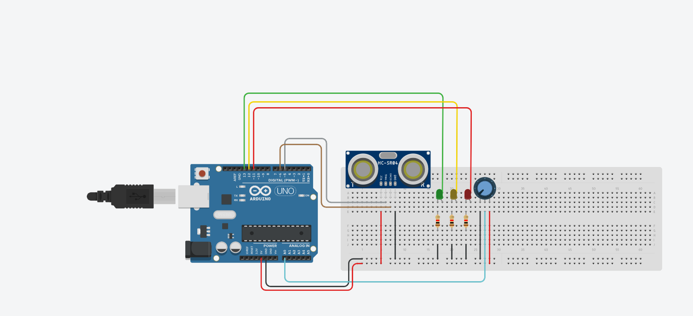

# 🚗 Projeto IoT - Garagem Mottu

Este projeto foi desenvolvido com foco em **IoT e prototipagem**. O objetivo é demonstrar uma solução que integra **Arduino**, **Node-RED** e **Tinkercad**, com protótipo real e dashboard para monitoramento em tempo real.

---

## 📹 Vídeo de Apresentação
👉 [Assista no YouTube](COLOQUE_AQUI_O_LINK)

---

## 💻 Tecnologias Utilizadas
- **Arduino (C++)** → código principal para controle do protótipo.
- **Tinkercad** → simulação do circuito eletrônico.
- **Node-RED** → dashboard para monitoramento em tempo real.

---

## 📂 Estrutura do Projeto
- `GaragemMottu/GaragemMottu.ino` → código-fonte do Arduino.
- `Dashboard.json` → fluxo e dashboard do **Node-RED**.
- `image/Thinkercad Arduino.png` → esquema do circuito no Tinkercad.

---

## 🚀 Como Executar

### 1. Arduino
- Abra o arquivo `GaragemMottu.ino` no **Arduino IDE**.
- Faça upload para uma placa **Arduino Uno** ou simule no **Tinkercad**.

### 2. Circuito
- Utilize a imagem abaixo como referência para a montagem.
- O circuito simula o sensor ultrassônico para medir distância e um potenciômetro para simular o GPS (localização).

 
### 3. Node-RED (Dashboard)
- Abra o **Node-RED** no navegador.
- Vá em **Menu → Import → Clipboard**.
- Copie e cole o conteúdo de `Dashboard.json`.
- O fluxo/dash será criado automaticamente, incluindo a configuração de entrada serial (Certifique-se de configurar a porta `COM` correta, atualmente está como `COM3` no arquivo).

### 4. Execução
- Execute o Node-RED.
- Visualize os dados de status, distância (Ultrassônico) e GPS (Potenciômetro) do Arduino no dashboard em tempo real.

---

## 📊 Detalhes Técnicos do Dashboard (Node-RED)

O dashboard é configurado para visualizar os seguintes dados:

| Componente | Dados Exibidos | Descrição |
| :--- | :--- | :--- |
| **Indicador de Status** | Texto e Cor | Exibe a mensagem de status da moto (`local correto` em verde, `em movimento` em laranja ou `alerta` em vermelho). |
| **Distância da Moto** | Gauge (Medidor) | Mostra a distância lida pelo sensor ultrassônico em **cm**. |
| **Gráfico GPS** | Gráfico de Linha | Monitora a variação do valor do potenciômetro (simulação do GPS) ao longo do tempo (valor de 0 a 1023). |

---

## 📊 Resultados Parciais
- Protótipo funcional no **Tinkercad**.
- Protótipo **real construído com Arduino** para validação prática.
- Código testado e validado no Arduino Uno.
- Dashboard do **Node-RED** configurado para exibir dados de telemetria.

---

## 👨‍💻 Integrantes do Grupo
- Thiago Henry Dias - Rm5545222
- Nicolas Dobbeck Mendes - Rm557605
- José Bezerra Bastos Net - Rm557605
